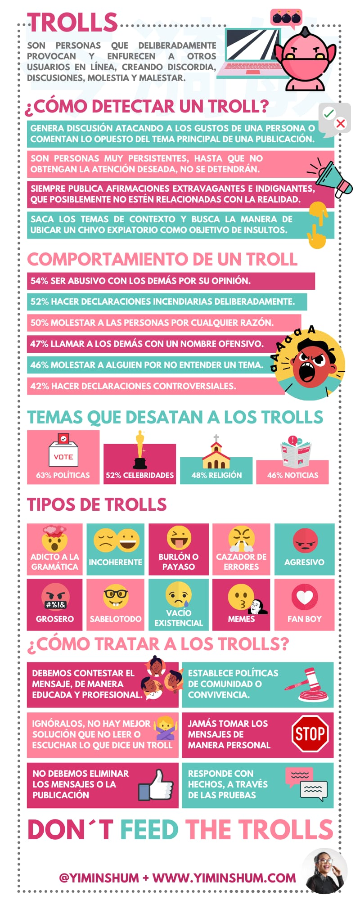

## La Netiqueta : comportar-se bé també a Internet**

Quan estem en línia, xatejant, pujant vídeos o comentant a xarxes socials, **no tot val**. Igual que a la vida real, a Internet també existeixen unes normes bàsiques de respecte i convivència: **la netiqueta**.

**Netiqueta** ve de *network* (xarxa) + *etiqueta* (bones formes). És un conjunt de normes que ens ajuden a tindre un comportament adequat i respectuós quan fem servir Internet, jocs en línia o xarxes socials.

---

### **Per què és important?**

* Perquè darrere d’una pantalla **hi ha persones reals**.
* Perquè les paraules també poden fer mal, encara que no les diguem cara a cara.
* Perquè crear un espai segur i amable en línia **és responsabilitat de totes i tots.**

---

### **Algunes normes bàsiques de Netiqueta**

✅ **Parla amb respecte.** No insultes ni et burles, encara que siga en broma.    
✅ **Pensa abans d’escriure o compartir.** El que poses pot quedar gravat o fer mal.    
✅ **No publiques imatges o vídeos d’altres sense permís.**    
✅ **Evita respondre amb ràbia.** Si t’enfades, respira i pensa abans d’escriure.    
✅ **No envies cadenes, fake news ni continguts violents.**    
✅ **Sigues empàtic.** Imagina com se sentiria l’altra persona llegint el que tu envies.    
✅ **Ajuda si veus una situació injusta.** No et quedes callat si presencies odi o assetjament digital.    

---

### **Reflexionem junts...**

* Et comportes igual a Internet que cara a cara?
* Alguna vegada has vist o patit comentaris que feien mal en una xarxa?
* Com et sentiries si algú publicara una foto teua sense permís?
* Què pots fer tu per crear un espai digital més sa?

---

## **Activitat:**

### **Crear un Genially: Comportament i normes a la xarxa**

* **Què és la netiqueta?**
* **Identitat digital** i **empremta digital**
* **Actituds positives** vs. **actituds negatives**
* **Trolls** i **haters**
* **Com detectar un troll**

---

### **Materials per a treballar**

**Font:** INCIBE (Institut Nacional de Ciberseguretat)
[Netiqueta: comportamiento en línea | Menores | INCIBE](https://www.incibe.es/menores/ciudadania-digital/comportamiento-linea/netiqueta)

[PantallasAmigas - Cómo actuar ante trolls](https://www.pantallasamigas.net/desafio-ciberconvivencia-como-actuar-ante-trolls-plataformas-sociales/)

---

### Joc interactiu

**No More Haters**
[https://play.nomorehaters.es/home](https://play.nomorehaters.es/home)

---

### Vídeo per reflexionar

---
