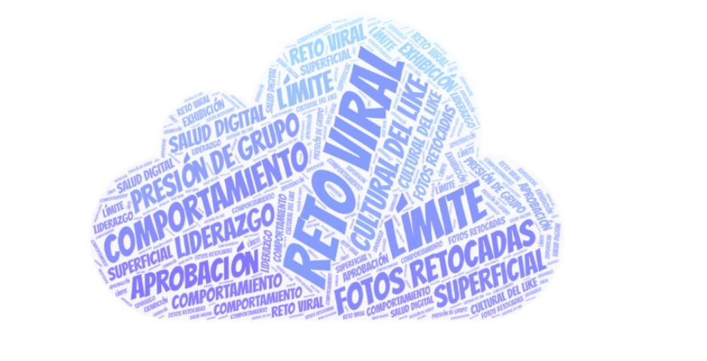

## Casos reals ciberassetjament

### Cas Oriana

---

### Nariz de Payaso

---

### Amanda Todd

---

## Adictes als likes

---

## Activitat Final

Anem a crear un nuvol de paraules similar a este:

### Reflexiona

Per tal de crear el nuvol, primer omplirem la fitza següent per parelles:

[Descarrega la fitxa Reflexiona...](Reflexiona.odt)

### Creació deñ nuvol de paraules:

Una volta treballada la informació, heu de crear un nuvol de paraules amb alguna de les següents eines:

<a href="https://wordart.com/" target="_blank">WordArt</a> 
<a href="https://www.mentimeter.com/es-ES" target="_blank">Mentimeter</a> 
<a href="http://www.tagxedo.com/" target="_blank">Tagxedo</a> 
<a href="https://worditout.com/" target="_blank">WordItOut</a> 

### Retpes Virals

**Investiga sobre estos reptes i crea un vídeo amb Canva**

Consulta estos enllaços per saber més:

* [Ice Bucket Challenge](https://es.wikipedia.org/wiki/Ice_Bucket_Challenge)
* [Mannequin Challenge](https://es.wikipedia.org/wiki/Mannequin_Challenge)

### Respon aquestes preguntes per a cada repte:

* **En què consisteix el repte?**
* **Quins riscos pot tindre?**
* **Per què penses que es va fer viral?**

---

### **Exemple de vídeo (pots inspirar-te):**

**Títol:** *Mannequin Challenge a l’aula*

Un grup d’alumnes estan congelats en diferents postures dins d’una aula moderna. Alguns escriuen als seus quaderns, altres tenen la mà alçada, un parell d’amics miren el mòbil rient, un alumne sembla que està badallant i un altre està a punt de tirar una bola de paper. La professora mira l’escena amb els braços creuats. L’aula és lluminosa, amb pupitres ben col·locats i una pissarra plena d’anotacions.

---

### **Crea el teu propi vídeo amb un repte lliure!**

**Pensa un repte nou o inspirat en un que conegues.** Pot ser divertit, reflexiu o creatiu, però sempre segur i respectuós.

**Exemple inventat:**

**Títol:** *Freeze de la lectura*

En una biblioteca, cada persona està congelada llegint un llibre diferent: algú amb un còmic obert i un somriure, una alumna amb un llibre de misteri i cara de sorpresa, un altre amb ulleres abaixades mig adormit, i una xiqueta asseguda a terra envoltada de contes. Tot està en silenci... congelat, com si el temps s’haguera parat mentre llegien.

