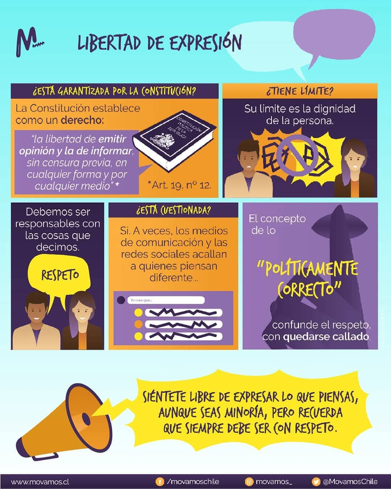

## Tolerància 0 al ciberassetjament

### Preguntes Debat

1. **Quins són els límits de la llibertat d’expressió a les xarxes socials i a Internet?**
2. **Haurien les plataformes digitals de tindre un paper més actiu en la moderació de continguts?**
3. **Com es pot equilibrar la llibertat d’expressió amb la protecció contra el ciberassetjament?**
4. **Haurien d’existir lleis més estrictes contra el ciberassetjament?**
5. **És l’anonimat a les xarxes socials i a Internet un dret o un risc per a l’abús?**
6. **Quin paper juga l’educació en la promoció del respecte a les xarxes i a Internet?**

---

### **INCIBE: Tolerància zero al ciberacós**

Informació clau per entendre què és el ciberassetjament, com detectar-lo i com actuar si passa a l’aula o en línia.

  <a href="https://www.incibe.es/menores/recursos/tolerancia-cero-al-ciberacoso/" target="_blank" class="btn btn-primary">
    Accedeix al recurs de INCIBE
  </a>

---

### Expressa't lliurement

{: .text-center }

---

## Com actuar davant el ciberassetjament?

### Fitxa didàctica (per treballar a l’aula)

  <a href="https://www.incibe.es/sites/default/files/2025-01/fichadidactica-taller-sid2025.pdf?sstc=u31386nl545796" target="_blank" class="btn btn-primary">
    Descarrega la fitxa didàctica de INCIBE
  </a>

---

###  Joc: *Sabries actuar contra el ciberassetjament?*

  <a href="https://www.incibe.es/sites/default/files/contenidos/materiales/Campanas/ciberacoso/is4k_sabes_actuar_contra_el_ciberacoso.pdf" target="_blank" class="btn btn-primary">
    Accedeix al joc sobre ciberassetjament
  </a>

---

