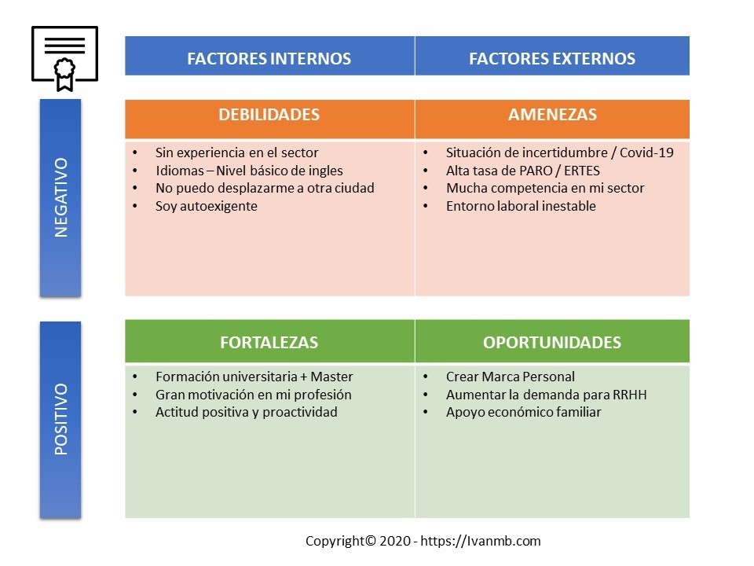

## Activitat DAFO - CANVA

# EL CANDIDAT IDEAL 

---

## **Descripció**

*“Sou l’equip de contractació d’una empresa digital. Heu de triar el millor candidat per al lloc de treball digital que us ha tocat. Cap candidat és perfecte, així que haureu de pensar quines competències són més importants per a aquest lloc i decidir qui seria la millor opció. Després haureu de dir com milloraríeu el perfil del candidat escollit.”*

---

## **1. Instruccions per als grups**

1. **Llegiu els 4 perfils de candidats.**
2. **Llegiu el lloc de treball digital** que us ha tocat (un diferent per a cada grup).
3. **Escriviu quines 3 competències creieu que són necessàries** per a aquest lloc.
4. **Debateu i trieu el candidat més adequat.**
5. **Escriviu 3 raons clares** de per què l’heu triat.
6. **Detecteu 2 punts febles** del candidat i proposeu **com millorar-los**.
7. **Expliqueu la vostra decisió** a la classe en 1-2 minuts.

---

## **2. Llocs de treball digitals**

### **1. Community Manager**

* Gestiona xarxes socials i respon a comentaris.
* Crea publicacions atractives i cuida la imatge d’una marca.

**Competències necessàries (escriviu-ne 3):**
1\.
2\.
3\.

---

### **2. Creador/a de Contingut per a YouTube/TikTok**

* Fa vídeos creatius i enganxosos.
* Coneix tendències digitals i sap editar vídeos.

**Competències necessàries (escriviu-ne 3):**
1\.
2\.
3\.

---

### **3. Dissenyador/a de Webs i Blogs**

* Dissenya pàgines web i blogs amb eines com WordPress o Wix.
* Cuida el disseny i el contingut atractiu.

**Competències necessàries (escriviu-ne 3):**
1\.
2\.
3\.

---

### **4. Editor/a de Vídeo i Imatge**

* Fa vídeos, cartells i presentacions visuals per a campanyes.

**Competències necessàries (escriviu-ne 3):**
1\.
2\.
3\.

---

### **5. Tester de Videojocs**

* Prova videojocs buscant errors i donant suggeriments.

**Competències necessàries (escriviu-ne 3):**
1\.
2\.
3\.

---

### **6. Suport Tècnic Digital**

* Ajudar persones a resoldre problemes informàtics o d’aplicacions.

**Competències necessàries (escriviu-ne 3):**
1\.
2\.
3\.

---

## **3. Perfils de candidats**

### **Paula (15 anys)**

**Punts forts:**

* Sap editar vídeos amb CapCut i Canva.
* És molt creativa i li agrada provar idees noves.

**Punts febles:**

* No sap gaire de seguretat i privacitat digital.
* De vegades es desorganitza amb els seus projectes.

---

### **David (14 anys)**

**Punts forts:**

* Té molts seguidors a TikTok i sap crear contingut viral.
* És espontani i sap captar l’atenció.

**Punts febles:**

* Publica sense pensar en privacitat.
* No treballa bé en equip i no sap buscar informació fiable.

---

### **Aina (15 anys)**

**Punts forts:**

* Sap crear blogs amb WordPress i fer presentacions bones.
* Té pensament crític i és molt responsable amb la seguretat.

**Punts febles:**

* No sap fer vídeos ni edició visual.
* Li costa seguir tendències ràpides de xarxes.

---

### **Marc (14 anys)**

**Punts forts:**

* Coneix Scratch i li agrada provar videojocs.
* És molt curiós i aprèn ràpid.

**Punts febles:**

* Li costa explicar les seues idees.
* No sap fer disseny ni treballa amb xarxes socials.

---

## **4. Preguntes per al debat**

* Quines 3 competències digitals són essencials per al lloc que us ha tocat?
* Quin punt feble del candidat escollit és més fàcil de millorar?, Com podríeu ajudar-lo a millorar?
* Qui és més important: algú molt creatiu o algú molt organitzat i segur?
* Si haguéreu de contractar dos candidats, quina combinació faríeu? Per què?
* Quina competència digital creieu que tindrà més valor d’ací 5 anys?

---

## **5. Fitxa de Grup**

### **Lloc de treball assignat:**

---

### **Competències clau per al lloc (3):**

1.\
2.
3.

---

### **Candidat escollit:**

---

### **3 Raons per les quals l'hem triat:**

1.
2.
3.

---

### **2 Punts febles del candidat:**

1.
2.

---

### **Com els milloraríem:**

1.
2.

---

